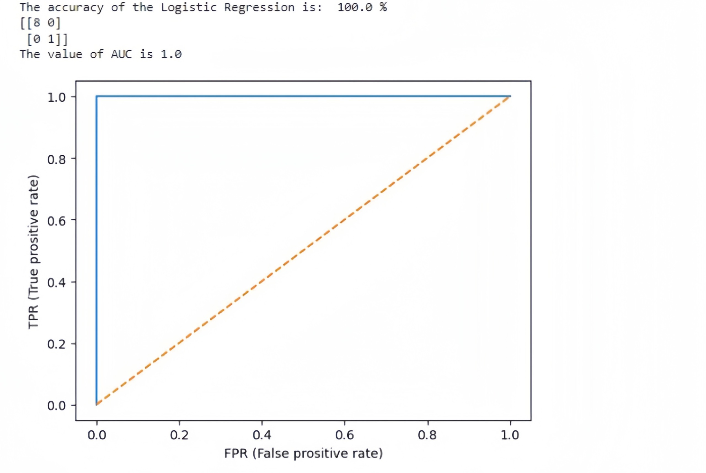

<html>
<head>
<title>mini-presentation</title>
<meta name="viewport" content="initial-scale:1.0;width=device-width">

</head>

 
    <ul >
        <li><a href="#Home">Introduction</a></li>
        <li><a href="#Overview">Bar Chart</a></li>
        <li><a href="#Hoc_van">Pie Chart</a></li>
        <li><a href="#4">Bubble Chart</a></li>
        <li><a href="#5">Logistic Regression</a></li>
        
    </ul>

<h1 id="div3" style="font-family:Bernard MT Condensed;border-radius: 12px;width:fit-content;box-shadow: 2px 7px 7px 0px black">1.Introduction </h1>

     After having the discussion about the topic for the mini-presentation, 
    group 2 decide to choose the topic as “Can we predict school performance based on English capability? Can we guess English skills from school performance?”. What is more, this images below show our progress of the survey. 

    

        

            

            
        

    

<h id="Overview"></h>
 
 
 
 

<h1 style="font-family:Bernard MT Condensed;border-radius: 16px;box-shadow: 2px 12px 10px 0px black;">2.Bar Chart </h1>

Because the number of students filling in each major is not the same, my group has divided the average GPA and English certificates. Here, it's the bar charts illustrate the AVG of 2 columns as GPA_point and CEFR_point.

 
 
 

    

        M
        I
        N
        I
        -
        P
        R
        E
        S
        E
        N
        T
        A
        T
        I
        O
        N
    

<h id="Hoc_van"></h>
 
 
 
 

<h1 id="Hoc_van" style="font-family:Bernard MT Condensed;width:fit-content;border-radius: 16px;box-shadow: 2px 12px 10px 0px black;">3.Pie chart </h1>

The pie chart illustrates the average performance rate per classes in HSB. Moreover, we can obviously see that from the chart there are 4 main classes.

<h id="4"></h>
 
 
 
 

<h1 style="font-family:Bernard MT Condensed;border-radius: 16px;width:fit-content;box-shadow: 2px 12px 10px 0px black;">4.Bubble chart </h1>

The provided data allows us to create a bubble chart that compares the CEFR points (X-axis) and GPA points (Y-axis) based on the "Program" column. Additionally, we will utilize the "OVR_Performance" column to determine the size of each bubble. 

<h id="5"></h>
 
 
 
 

<h1 id="Hoc_van" style="font-family:Bernard MT Condensed;border-radius: 16px;width:fit-content;box-shadow: 2px 12px 10px 0px black;">5.Logistic Regression </h1>

Particularly, we only apply the machine learning of the Logistic Regression to predict 2 kinds of students as good and not bad. As you can see in my screen here, this is our model and we use the data based on our survey.

    

        

        
    

</body>
</html>
